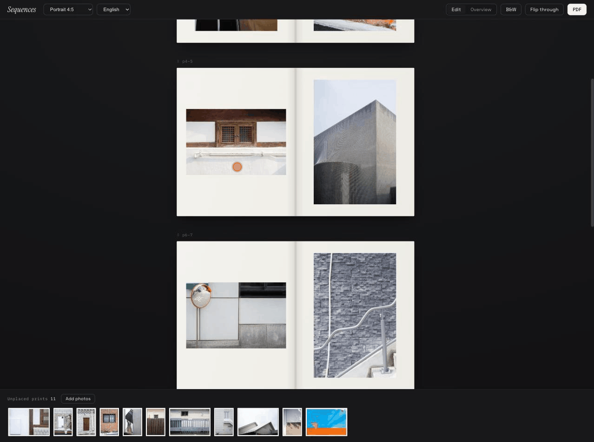
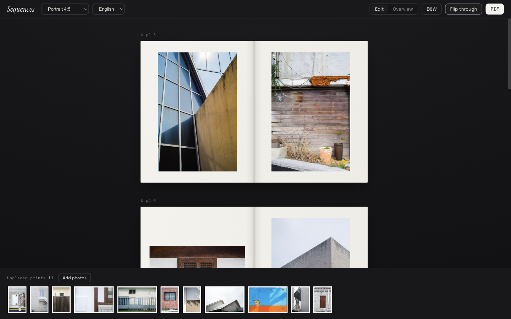
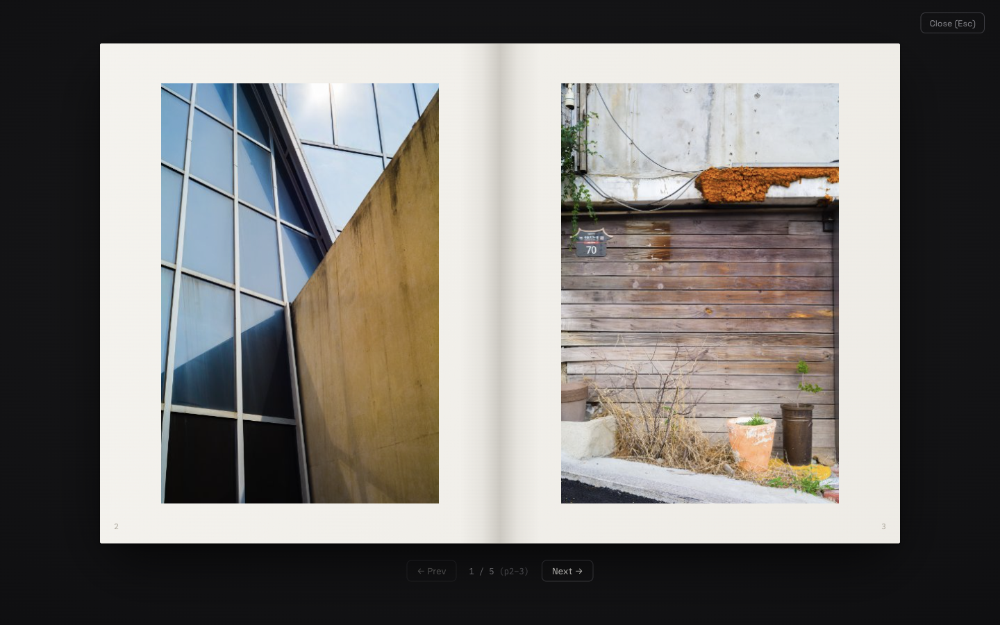
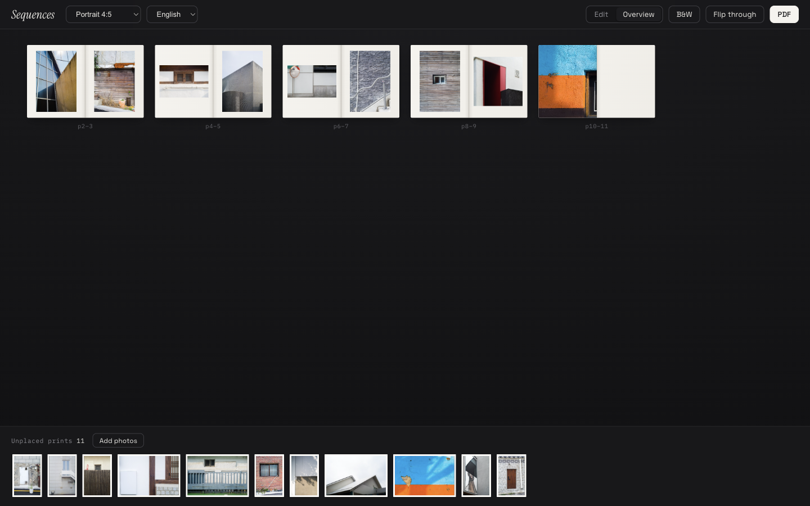

# Sequences

[English](README.md) · [한국어](README.ko.md) · **日本語**

写真集の**シーケンス**（構成）のためのローカルファーストなWebアプリです。
レイアウトソフトを開く前の、どの写真をどこに置くかを決める編集作業を
ブラウザで行います。写真をトレイに取り込み、見開きにドラッグして配置し、
向かい合うペアを検討し、束見本のようにページをめくって確かめます。

すべてのデータはブラウザ（IndexedDB）にのみ保存されます。サーバーも
アップロードもありません。

**今すぐ試す → [sequences.kelupus.com](https://sequences.kelupus.com/)**



## なぜ作ったか

シーケンスの作業は、ふつうワークプリントを壁に貼りながら行います。既存の
ツールは本格的なレイアウトソフト（InDesign、Lightroom Book）か汎用の
ホワイトボードで、いちばん大事なもの — **向かい合う2ページ** — を見せて
くれません。Sequencesは作業のあいだずっと見開き単位で考えさせてくれます。

## 機能

- **見開きエディタ** — 机に並べた本のように見開きが縦に流れます。トレイから
  ページへドラッグ配置、ページ間の入れ替え、見開きの並べ替え。ページには
  verso/rectoと実際のページ番号が付きます。
- **ページプリセット** — ページごとに全面裁ち落とし／余白レイアウト。
  ペーシングのために空きページも。ページ比率は選択可能
  (4:5、3:4、2:3、1:1、横位置)。
- **モノクロ切替** — トーンの流れを確認するための白黒表示。
- **一覧** — 全見開きをコンタクトシートのように1画面で。
- **めくりプレビュー** — 3Dページターンの束見本モード。編集していた見開き
  から開きます。矢印キー／スペースでページ送り。
- **PDF書き出し** — 見開きごとに1ページ、折り線とノンブル付き。紙の束見本
  づくりに。
- **ローカル保存** — 写真とシーケンスはIndexedDBに保存され、リロードしても
  残ります。書き出しは原寸データ、画面表示は生成サムネイルを使用。
- **保存／読み込み／リセット** — プロジェクト全体（シーケンス＋写真）を
  1つのファイルに書き出し、別のマシンで読み込み。すべて消してやり直すことも。
- **多言語** — 한국어 / English / 日本語（自動判定、切替可能）。

| 見開きエディタ | めくりプレビュー |
| --- | --- |
|  |  |



## 実行

```bash
npm install
npm run dev
```

React + TypeScript + Vite製。写真がブラウザの外に出ることはありません。

## ライセンス

[MIT](LICENSE)
